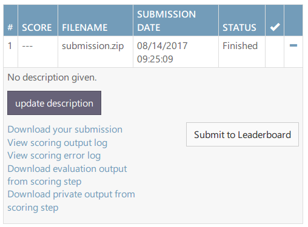
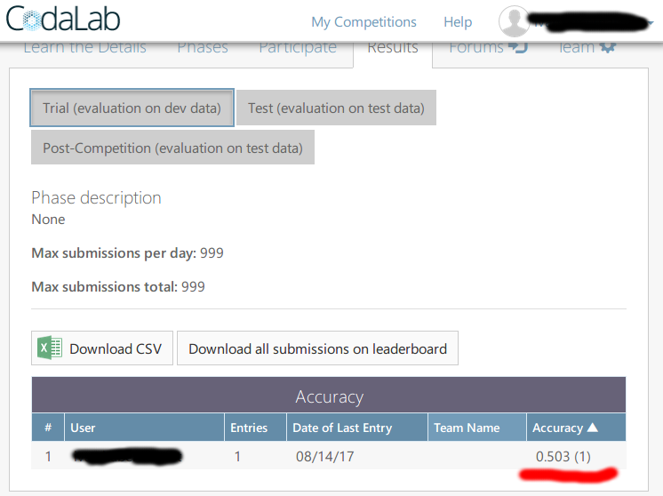

# SemEval-2018 Task 12: CodaLab Competition

This repository provides supplementary code for the SemEval-2018 Task 12 competition (The Argument Reasoning Comprehension Task). It contains the CodaLab Competition definition, the official scorer, a baseline random system, as well as mirrored training/dev data.

Source codes and datasets regarding the The Argument Reasoning Comprehension Task itself are located in a [separate GitHub repository.](https://github.com/UKPLab/argument-reasoning-comprehension-task/)

## For participants

### Creating output file

The output format is shown in `submission/answer.txt`. Replace its content with your predictions, see for instance the baseline system which implement a random classifier in `baseline-system`.

### Creating `submission.zip`

Prepare submission ZIP file and submit via the Web interface

```
$ make submission.zip -B
```
### Walk-trough example: Random baseline system

The following text describes how to make predictions using the baseline system - a random classifier which gives the lower-bound accuracy of 50%.

* Build the example random baseline classifier
```
$ cd baseline-system
$ mvn package
```
* The baseline system needs no training. However let's download the training data from [GitHub]((https://github.com/UKPLab/argument-reasoning-comprehension-task/tree/master/mturk/annotation-task/data/exported-SemEval2018-train-dev-test)) and pretend the system wants to learn something. ***Notice*** All data are also mirrored in this repository in the `data` folder.
```
$ wget https://raw.githubusercontent.com/UKPLab/argument-reasoning-comprehension-task/master/mturk/annotation-task/data/exported-SemEval2018-train-dev-test/train-full.txt
```
* Download the evaluation data without labels (referred to as `dev-only-data.txt`) from [GitHub](https://github.com/UKPLab/argument-reasoning-comprehension-task/tree/master/mturk/annotation-task/data/exported-SemEval2018-train-dev-test)
```
$ wget https://raw.githubusercontent.com/UKPLab/argument-reasoning-comprehension-task/master/mturk/annotation-task/data/exported-SemEval2018-train-dev-test/dev-only-data.txt
```
* Run the system on the data to make predictions (the parameters are: training data, test data, output predictions; we will use a relative path for training and test data and an absolute path for the predictions but you can freely mix relative and absolute as in any command-line program)
```
$ java -jar target/baseline-system-1.0-SNAPSHOT.jar train-full.txt dev-only-data.txt /tmp/pred.txt
```
As you can see in the following snippet, the output file contains only instance IDs and the predicted label. This is the output you will have to submit to the CodaLab scorer (details later on).
```
$ head /tmp/pred.txt 
#id     correctLabelW0orW1
14085524_189_A34QZDSTKZ3JO9     0
16629299_15_A1CF6U3GF7DZEJ      1
14164520_257_A34QZDSTKZ3JO9     1
16967643_582_A1DJNUJZN8FE7N     0
15769481_321_A138BU1VWM2RKN     0
16157609_550_APW9F8OTJ4KXO      0
14106155_221_A3TKD7EJ6BM0M5     1
14228063_268_A1I4CYG5YDFTYM     0
17024278_160_A1J0GU26323WVA     0
```

#### Evaluating the baseline system - locally

You can evaluate your system on the `dev` data locally without submitting it to CodaLab in the first place.

* Build the scorer
```
$ cd codalab/scorer
$ mvn package
```
* Download the gold labels for the dev data (referred to as `dev-only-labels.txt`) from [GitHub](https://github.com/UKPLab/argument-reasoning-comprehension-task/tree/master/mturk/annotation-task/data/exported-SemEval2018-train-dev-test)
```
$ wget https://raw.githubusercontent.com/UKPLab/argument-reasoning-comprehension-task/master/mturk/annotation-task/data/exported-SemEval2018-train-dev-test/dev-only-labels.txt
```
* Run the scorer using your predictions in `pred.txt`
```
$ java -jar target/scorer-1.0-SNAPSHOT.jar -local dev-only-labels.txt /tmp/pred.txt
Accuracy: 0.503
```
Which gives us the expected accuracy of a random classifier.

#### Evaluating the baseline system - on CodaLab

We should get the very same results also on CodaLab.

* Copy the system's predictions to `answer.txt` (this name is required by CodaLab)
```
$ cd codalab/competition
$ cat /tmp/pred.txt > submission/answer.txt 
```
* Create the `submission.zip` file using `make`
```
$ make submission.zip -B
```
(If you don't have `make`, you can alternatively zip it using ```cd submission && zip ../submission.zip * && cd ..```)
* Upload `submission.zip` to CodaLab


* You can download the results from Codalab: `Download evaluation output from scoring step` which contains `scores.txt` with a single line: `Accuracy: 0.503`



* You can submit the results to the leaderboard




## For organizers

### Creating `competition.zip`

Build and upload using the Web interface

```
$ make competition.zip -B
```